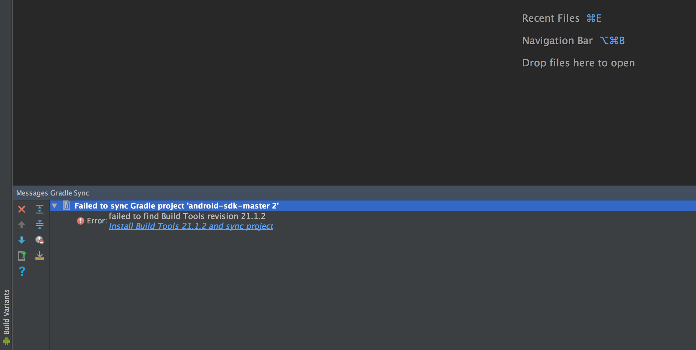
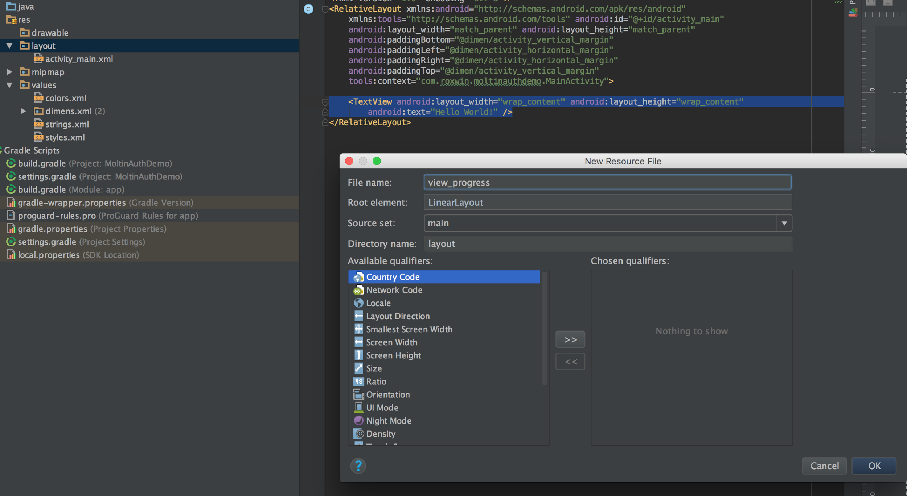
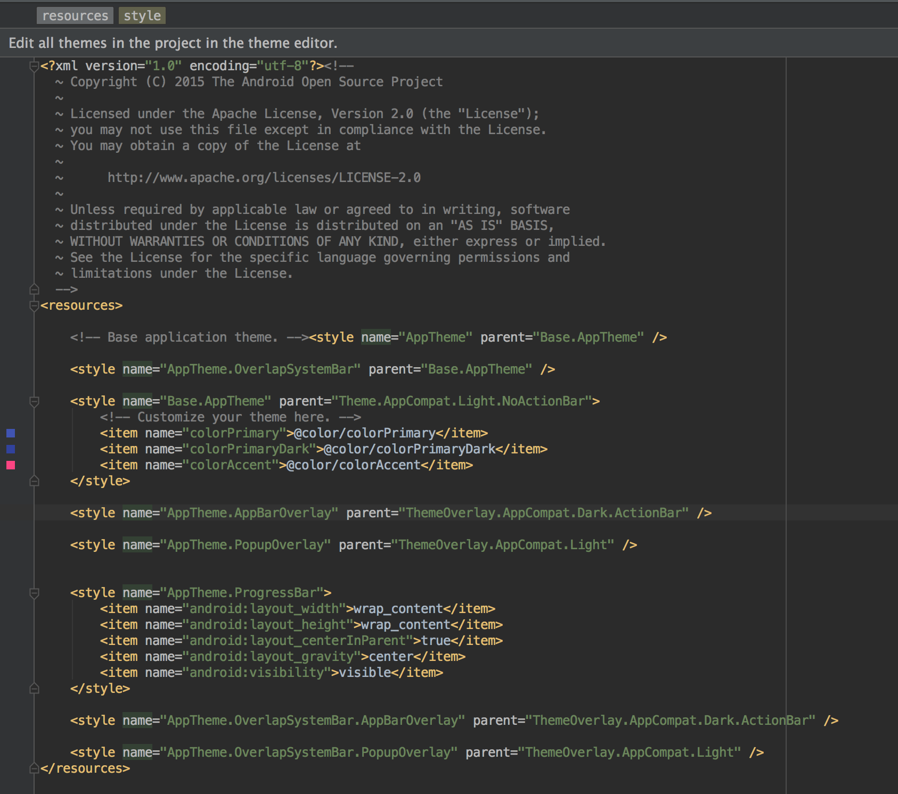
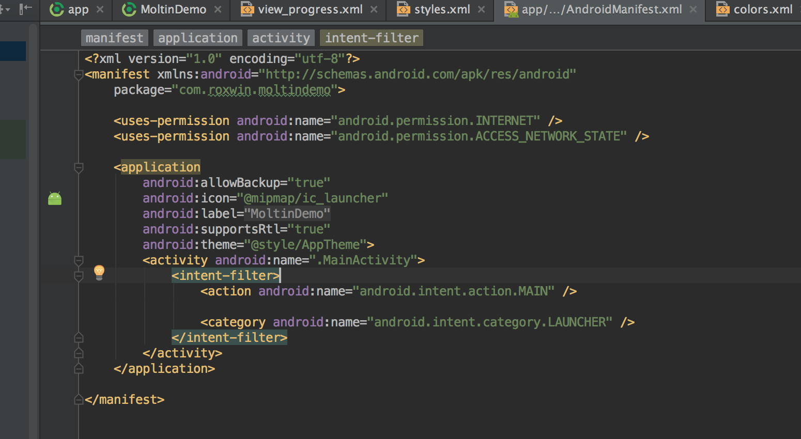

1. Setup Environment

	I developed this project on Android Studio and Java 1.7

[https://developer.android.com/studio/index.html](https://developer.android.com/studio/index.html)

2. Setup Project

	As this is a demo project for Moltin authentication, I have only created a demo screen. To do this, open Android Studio and create a project by choosing File > New > New Project. You will now see this screen:

Next, you need to choose your Application Name, Company Domain and Project Location. Click ‘Next’ twice and then you will come to ‘Add an Activity to Mobile’ screen. Choose ‘Empty Activity’ and click ‘Next’ again. This will ask you to choose the name of the activity. This is not particularly important and so you can set it as default values: MainActivity and activity_main for ‘Activity Name’ and ‘Layout Name’ and then click ‘Finish’.

It may take a few minutes for Android Studio to set up your project. Once this is done you will have a clean Android project. The next step is to add Moltin’s Android SDK to the project so you can take API calls. 

3. Setup Moltin Android SDK

Go to  the following link and download the whole project: [https://github.com/moltin/android-sdk](https://github.com/moltin/android-sdk)

Choose Download ZIP to download this project to your computer.

Unzip file you’ve just downloaded and open this project by Android Studio, follow this step:

* Go to Android Studio, choose File -> Open.

Choose the path to folder you’ve just unzipped. Normally the folder’s name is android-sdk-master. Click OK and wait a few minutes for importing the project. If you see the following error in Android Studio when it is finished importing then click Install Build Tools 21.1.2 and sync the project. Android Studio will download some libraries to allow you to build the project. 

Wait until Android Studio has downloaded successfully. When active, click the ‘Finish’ button to return to the project, where Android Studio will try to build the project again.

Note: remember now you’ve had two projects, one is ‘Demo Project’ and the second is ‘Library Project’

* Go to Android Studio, choose Build -> Rebuild Project 

It will build successfully and export the library file for you.

Go to the path of the Moltin SDK Project and copy library file. That file will be in this path: 

[moltin lib root folder]/build/outputs/aar/

And it’s named: android-sdk-master-debug.aar

Come back to the first project and copy .aar file to libs folder of this project. Lib folder is in this path

[Your Project Folder]/app/libs/

4. Configure the config file of the demo project

Now you’ll have to configure your project to be able to recognize the Moltin SDK lib file.

Android Studio has many ways to view the structure of your project. You can choose it at the top left of your screen.

I usually choose ‘Android Type’ to see the project structure.

In the Project Structure Panelchoose build.gradle file. Note that you have two build.gradle files, one for whole Project and the other for the app. 

Open build.gradle (Module: app) as we’re going to change something to configure the project to recognize the SDK library.

You now need to add two fractions of text into this file.


repositories {
    flatDir {
        dirs 'libs'
    }
}

compile(name:'android-sdk-master-debug', ext:'aar')

Now you’ve done that, you are able to use Moltin SDK.

5. Develop UI for user interaction with your app

To be able to authenticate the API, Moltin provides you with an api_key. I created a Demo app on the Moltin website and generated a key. You can do the same by creating an account at [https://accounts.moltin.com](https://accounts.moltin.com) and copy the client ID. 

Next, you need to add this String into your project. We will add this file in the strings.xml file.

Open strings.xml file from the project structure on the left.

Then add the api_key String like this:

Next step, is to build a layout to interact with the User. I’m going to create a layout with a login/logout button and text below it to see the status of the connection cycle.

Open the project structure on the left again and choose App > Res > Layout > Activity_Main.xml.

You will see the default layout of this screen clear the whole file and add a button, 2 textview to this layout

Android Studio will show you some errors because there are some Strings and layouts in this file you haven’t defined.

Open strings.xml again and add missing content to it.

There is one error  in activity_main.xml. Don’t worry we will finish it now.

Right click in layout on the left and create new layout 

Click OK and then Android Studio will lead us to a new screen.

See the bottom and you will see the switcher Design/Text. Choose Text to develop view_progress layout

Copy my code and paste in

<RelativeLayout xmlns:android="http://schemas.android.com/apk/res/android"
    android:id="@+id/rl_progress"
    android:layout_width="match_parent"
    android:layout_height="match_parent"
    android:visibility="gone">

    <ProgressBar
        style="@style/AppTheme.ProgressBar"
        android:layout_centerInParent="true" />

</RelativeLayout>

 

This may alert you to errors because you forget define style.

Open App > Res > Values > Styles.xml on the left panel and paste this content:

Now every error should have disappeared. 

6. Add permissions for your app to be able to take the API call via the internet. 

If you want to use the internet in your app, you have to set this up in your project. Android manages permissions in the manifest file. Open App > Manifests on the left panel and add two permissions for your app:

<uses-permission android:name="android.permission.INTERNET" />
<uses-permission android:name="android.permission.ACCESS_NETWORK_STATE" />

7. Develop and authenticate with Moltin

Open Ppp >Java > Com.roxwin.moltinauthdemo > MainActivity on the left panel

    1. SetupView:

This method will map buttons, textviews and views in MainActivity.java to activity_main.xml. 

    2. SetupMoltin

This method will setup Moltin class - it needs to attach to an activity every time you want to use Moltin class.

    3. TryToLoginToMoltin:

We have a flag for the connection status., this wasLogin variable. If we have already logged in to Moltin, wasLogin variable is true, otherwise it’s false.

Moltin class has a method for authentication and we need to pass the api_key that we already defined in Strings.xml earlier, and the second parameter for the authentication method is a callback. If you login unsuccessfully it will be returned in this callback. In this callback we will set a flag for wasLogin again and set the status of the button to Logout if it logged in successfully, and Login if it logged in fail. 

If our app login is successful, the status text will show content to say Moltin returned. It contains the expired time, access_token etc. 

If login fails the status text will show Not Login text.

    4. When app first runs, we will call 3 method follow:

setupView();

setupMoltin();

tryToLoginToMoltin();

Why do we call tryToLoginToMoltin when app first runs? Because I want to check if this app logged in or not.

tryLoginToMoltin method will be called in another place - when you click login button.

Each time we call tryToLoginToMoltin, I will show a progress dialog to intercept user interaction with the UI. Then when I receive the result from login I dismiss the progress dialog.

8. More detail about how Android app can connect to Moltin by "Moltin API  Key"

If you work with Moltin, you will have to have an API_key that is generated from the Moltin Server for you to be able to call the APIs to the server.

Here is an example of an Api_key: 3ihCcsm3VtA6Ngeoms4BAfwAVptCZufFpL5Vjxkyj7

You have to store this key somewhere in your project. Here I stored mine in a strings.xml file. This is not the only way -  you can also store it in file class.java, in gradle configuration file too. 

After you finish storing the Moltin API key in your project, the next step is to write code using that api_key and authenticate with the Moltin Server. You will have to import Moltin Lib into classes that you want to call API to Moltin Server. In this project, I interacted with Moltin Server in com.roxwin.moltinauthdemo.MainActivity.class. You can import that lib by using this fraction of code

import moltin.android_sdk.Moltin;

import moltin.android_sdk.utilities.Constants;

In the onCreate method of this activity, you have to define a variable and set up Moltin class to attach to activity.

  private Moltin moltin;

moltin = new Moltin(this);

Now, it’s time to use the Moltin_api_key and authenticate to the Moltin Server. You can write an authentication method to be able to reuse it. In this project I wrote tryToLoginMoltin(). Then you use authenticate method in Moltin SDK Lib like this:

moltin.authenticate(getString(R.string.moltin_api_key), new Handler.Callback() {

    @Override

    public boolean handleMessage(Message msg) {

        Log.d("Message from Server",msg.obj.toString());

        

        if (msg.what == Constants.RESULT_OK) {

            Log.d("Authentication Status", "Success");

        } else {

            Log.d("Authentication Status", "Failure");

        }

        

        return true;

    }

});

You can check the status of msg.what to know if you login successfully or not. 

You only need to login one time, the Moltin SDK Lib stores status of your authentication to process next API calls in the Moltin SDK lib.

